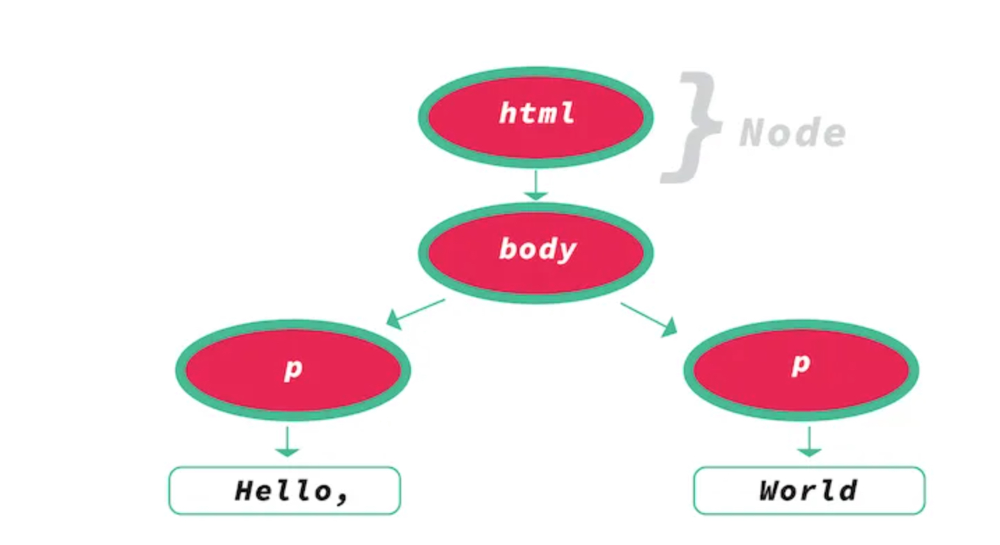
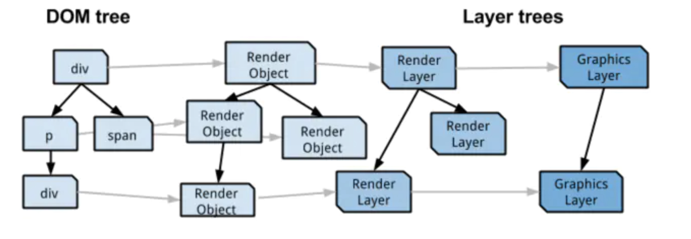
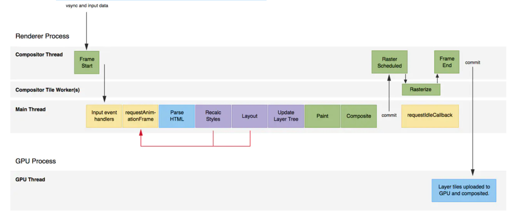

## 浏览器渲染

-   浏览器渲染步骤
    起点总是先获取一个html
    1. byte -> characters
    计算机只认识二进制数据，所以从网络上拿到的资源都是0跟1，浏览器要按照HTML的编码，将二进制数据转换为字母（字节层 -> 字符层）
    2. characters -> tokens
    引擎文件的格式(html 4?5?xml?)按照词法分析，对characters进行解析，将html标记块解析成token
    3. tokens -> nodes
    按照词法分析的结果，将tokens转化为节点，节点是一种特殊的数据结构，是DOM的每一个节点（此处可以扩展到DOM各节点的type等知识点）
    4. nodes -> doms
    按父子关系与邻居关系，将node link成一个tree
    

    css 同样也会经历上面的步骤
    只不过是通过nodes -> cssoms

    5. dom + cssom -> render tree
    dom代表了父子及层级关系，cssom代表了各节点的样式规则，合二为一变成一个用于渲染的数据结构为render tree。这个结构中只存在可显示的节点，display: none的节点会在其中移除。
    
    还有Render Layer用来解决层叠上下文的问题，Graphics Layer，Graphics Context用来使用硬件加速的图层

    6. layout
    引擎会按browser viewport来依据渲染树进行布局的计算。这里会考虑到内容和样式，进行必要的布局计算（repaint在这里如何避免?）

    7. paint (to be completed)
    

-   阻塞渲染的资源 Render blocking resources
    -   保证重要的 html & css 能够尽快加载
    -   css的加载速度会直接影响到后面的js执行

-   Event Loop

-   系统实现
    -   blink与webkit使用2个进程来搞定js及渲染的任务
        -   renderer进程，每个tab一个，会包含3个线程
            -   Main thread
            -   Tile Worker
            -   Compositor Thread
        -   GPU进程，整个浏览器共用1个
            主要是负责把Renderer进程中绘制好的tile位图作为纹理上传至GPU，并调用GPU的相关方法把纹理draw到屏幕上。

-   一些问题
    -   浏览器是否会预先review一遍所有文件，预先一起发起请求，还是解析到哪里再发起请求？
    浏览器会预先扫一遍文件，直接发送请求，不需要被js执行阻塞

-   demo
    -   domcontentload-fp.html
    这个demo里，将网速调成slow 3G，可以说明2个问题
        1. 我们可以看到，A1与黄色背景先出现，A2和红色背景后出现，说明阻塞渲染不需要等待 DOMContentLoaded事件触发，也就是说dom未被完全准备好的时候，已经可以渲染了
        2. js的执行会阻塞渲染，即使在同一段js中调用会reflow的api，也只是会触发布局的重新计算，而不能重新直接渲染。

-   参考文献
    -   https://blog.logrocket.com/how-browser-rendering-works-behind-the-scenes-6782b0e8fb10/ 讲述了从接收byte到渲染的整个过程

    -   https://html.spec.whatwg.org/multipage/webappapis.html#event-loops html规范 讲event loop + 渲染过程