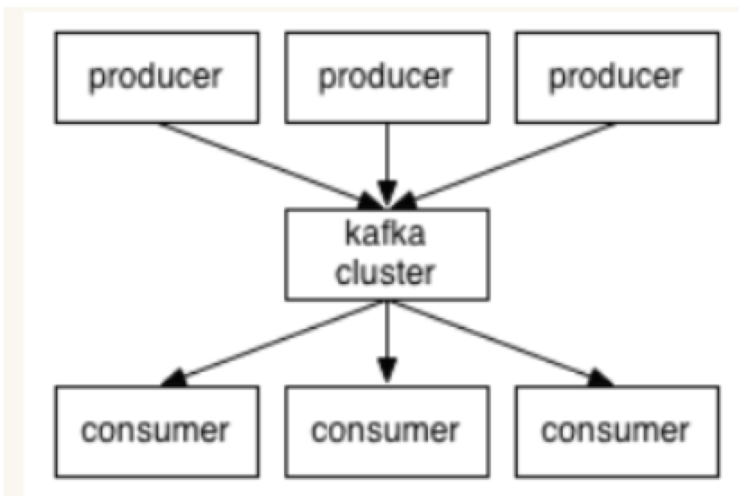

## Kafka

Apache Kafka 是一个分布式发布 - 订阅消息系统和一个强大的队列，可以处理大量的数据，并使你能够将消息从一个端点传递到另一个端点。 Kafka 适合离线和在线消息消费。

-   专业术语

    -   生产者和消费者
    producer和consumer
    -   broker
    集群中有很多台 Server，其中每一台 Server 都可以存储消息，将每一台 Server 称为一个 kafka 实例，也叫做 broker
    -   topic
    一个 topic 里保存的是同一类消息，相当于对消息的分类，每个 producer 将消息发送到 kafka 中，都需要指明要存的 topic 是哪个，也就是指明这个消息属于哪一类
    -   partition
    每个 topic 都可以分成多个 partition，每个 partition 在存储层面是 append log 文件。任何发布到此 partition 的消息都会被直接追加到 log 文件的尾部。为什么要进行分区呢？最根本的原因就是：kafka基于文件进行存储，当文件内容大到一定程度时，很容易达到单个磁盘的上限，因此，采用分区的办法，一个分区对应一个文件，这样就可以将数据分别存储到不同的server上去，另外这样做也可以负载均衡，容纳更多的消费者。
    -   Offset
    一个分区对应一个磁盘上的文件，而消息在文件中的位置就称为 offset（偏移量），offset 为一个 long 型数字，它可以唯一标记一条消息。由于kafka 并没有提供其他额外的索引机制来存储 offset，文件只能顺序的读写，所以在kafka中几乎不允许对消息进行“随机读写”。

-   key point
    -   kafka是分布式消息队列，消息是存储在topic内的，每个topic可以有n个消费者，且每个消费者都可以消费到队列里的每条消息。