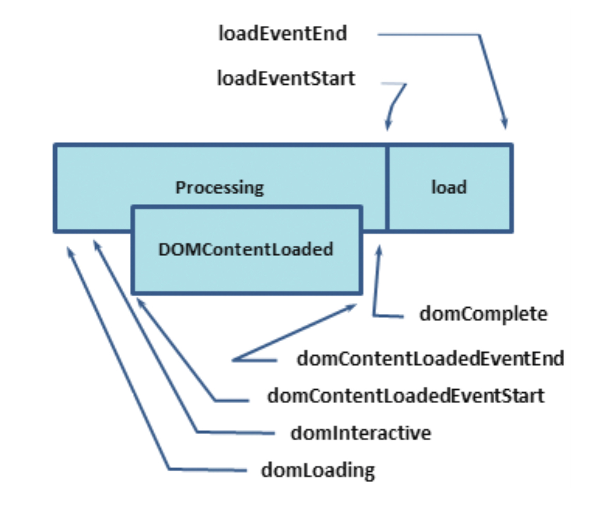
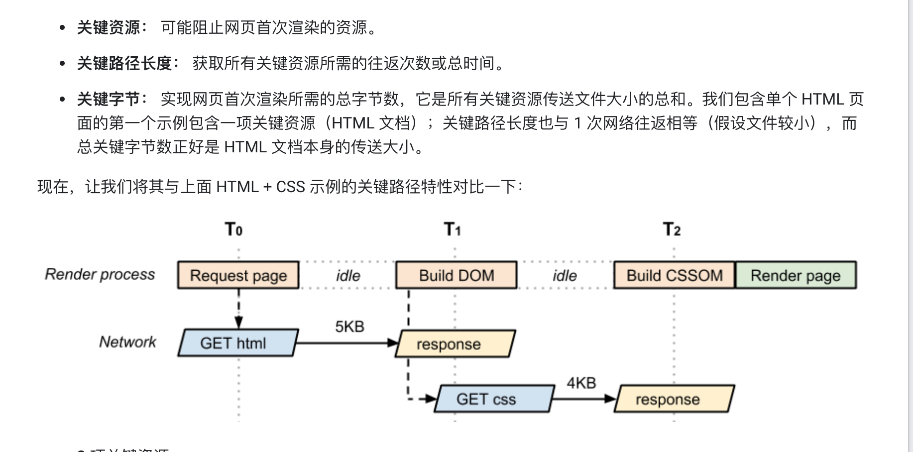

## 关键渲染路径的测量

-   接受到html的字节后的一些关键时间戳

    -   domLoading
    这是整个过程的起始时间戳，浏览器即将开始解析第一批收到的 HTML 文档字节。

    -   domInteractive
    表示浏览器完成对所有 HTML 的解析并且 DOM 构建完成的时间点

    -   domContentLoaded
    表示 DOM 准备就绪并且没有样式表阻止 JavaScript 执行的时间点，这意味着现在我们可以构建渲染树了。

    -   domComplete
    顾名思义，所有处理完成，并且网页上的所有资源（图像等）都已下载完毕，也就是说，加载转环已停止旋转。

