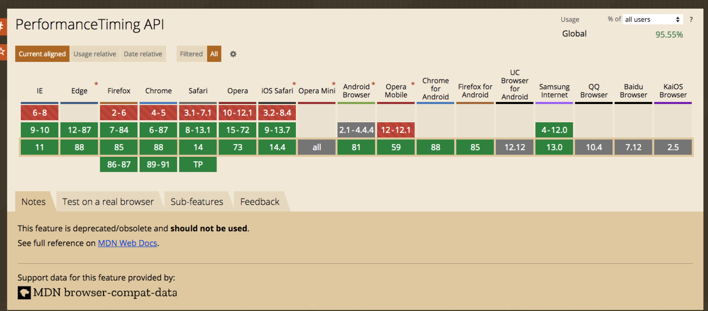
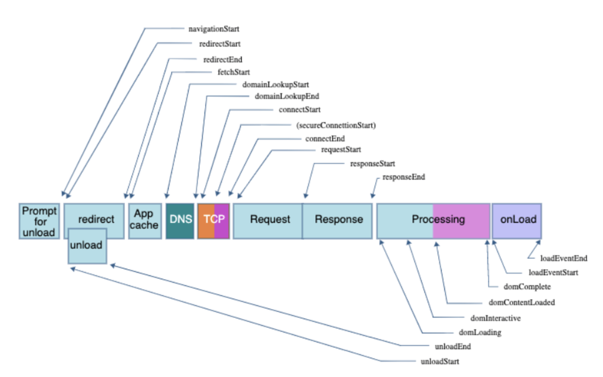
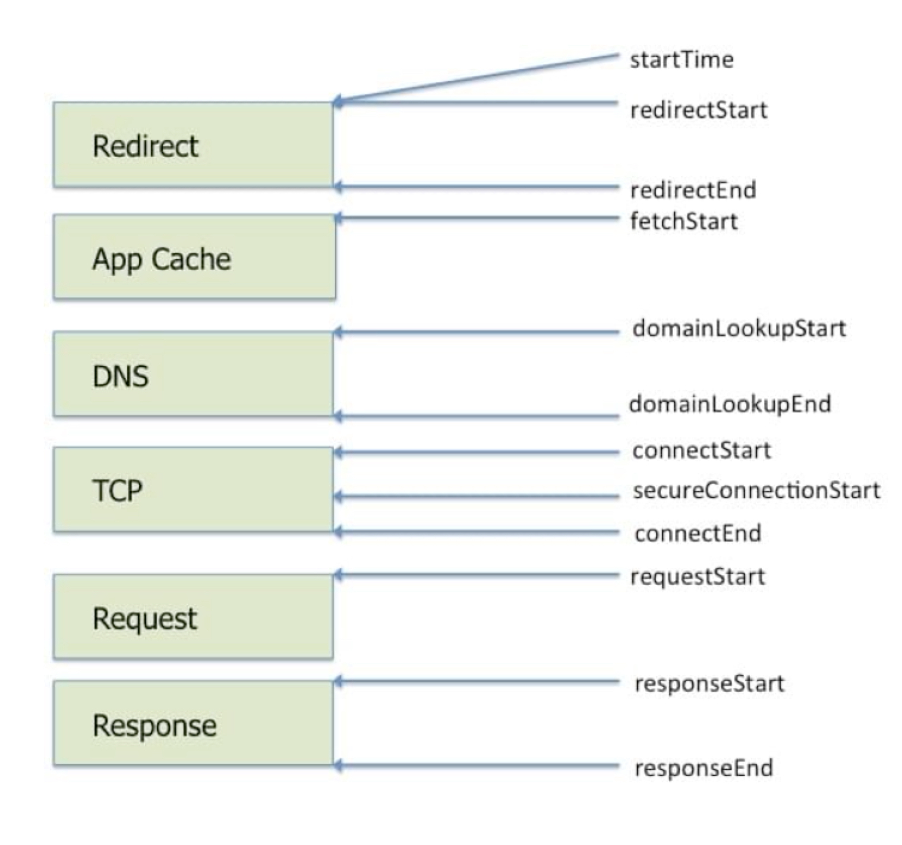

-   PerformanceTiming api

    -   已经废弃，但是被各大浏览器作为向后兼容仍然支持

    

    -   返回的都是毫秒级时间戳

    -   下面按顺序列举字段
        -   navigationStart
        上个页面决定unload的时间

        -   unloadEventStart
        unload开始的时间

        -   unloadEventEnd
        unload结束的时间

        -   redirectStart
        HTTP重定向开始的时间，不同源为0

        -   redirectEnd
        HTTP重定向结束的时间，不同源为0

        -   fetchStart
        浏览器准备好去用HTTP请求获取文档，并且在检查任何缓存之前的时间

        -   domainLookupStart
        DNS解析开始，如果本地有解析缓存的结果或持久链接，时间与fetchStart一致

        -   domainLookupEnd
        DNS解析结束时间，如果本地有解析缓存的结果或持久链接，时间与fetchStart一致

        -   connectStart
        当请求开始建立连接的时间，如果传输层报错了并且重新开始建立链接，按最后一次建立连接的时间为准。如果有持久化链接可以复用的话，时间与fetchStart一致

        -   connectEnd
        当请求建立连接结束的时间，如果传输层报错了并且重新开始建立链接，按最后一次建立连接的时间为准。如果有持久化链接可以复用的话，时间与fetchStart一致。结束时间是指包括所有（安全）握手、socks、认证全部结束

        -   secureConnectionStart
        安全链接握手开始的时间。如果没有该阶段，返回0

        -   requestStart
        浏览器发送请求获得文档的时间（无论是从服务器还是缓存）。如果传输层在开始请求并且链接重新打开后失败了，这个时间也会被设置为新请求的开始的时间

        -   responseStart
        浏览器获取相应的第一个byte的时间

        -   responseEnd
        浏览器接收到相应的最后一个byte的时间，或链接第一次关闭的时间。

        -   domLoading
        dom开始解析的时间点，同时会设置Document.readyState -> loading, 触发readystatechange事件

        -   domInteractive
        dom解析文档结束的时间，同时设置Document.readyState -> interactive，触发readystatechange事件

        -   domContentLoadEventStart
        在解析器触发DOMContentLoaded事件之前

        -   domContentLoadEventEnd
        就在所有需要被执行的脚本都执行完后，不考虑顺序

        -   domComplete
        当解析器结束工作，设置Document.readyState -> complete 并且触发readystatechange事件

        -   loadEventStart
        load时间触发的开始时间，如果还没触发，为0

        -   loadEventEnd
        load的回调结束的时间，如果还没触发

    

    -   dns  = time.domainLookupEnd - time.domainLookupStart,
    -   tcp  = time.connectEnd - time.connectStart,
    -   ssl = !!time.secureConnectionStart,

    -   ttfb = time.responseStart - time.navigationStart;

-   Navigation Timing API

    -   protocol = timing.nextHopProtocol

    -   compressionSavings = 1 - (timing.transferSize / timing.decodedBodySize)

    

https://juejin.cn/post/6844903667733118983